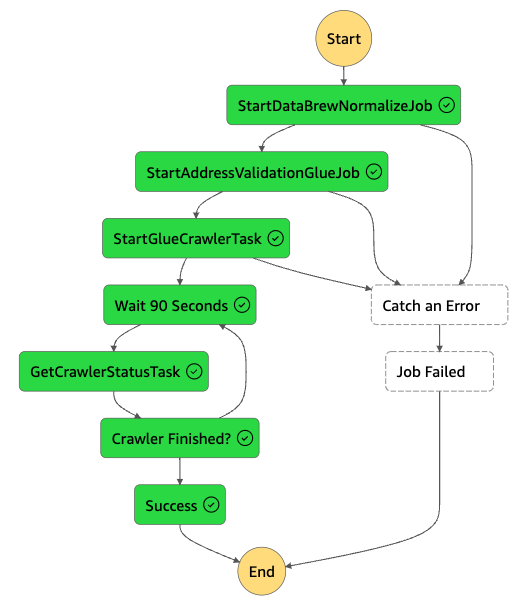
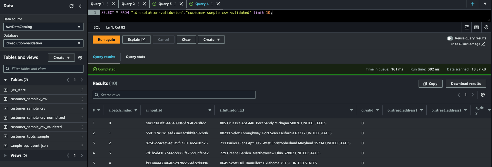
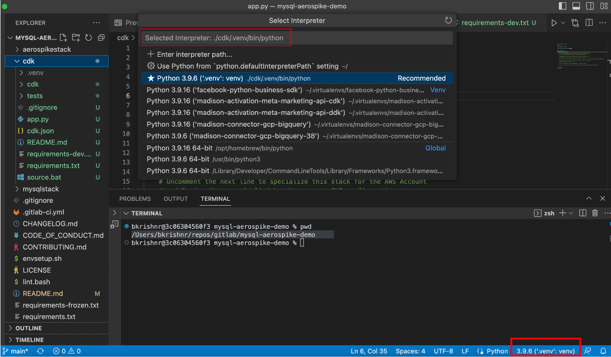

# Data Normalization and Validation for Entity Resolution on AWS

## Introduction
Data collected about consumers is a valuable asset for an organization. Quality of data collected varies widely because of the variations in the controls put in the system of engagements/records. The lack of standardization and low quality of data collected from these variety of sources becomes a bottleneck in complex workflows like Entity resolution where the data attributes are matched against each other.

The accuracy of Entity resolution is dependent on the quality of the input data sets. In addition to this, for better Customer Experience and Marketing outcomes the PII data entities like Physical Address, Email, Phone Numbers have to be validated for deliverability. 

## Guidance Description
This guidance sample repository provides a quick start template to build a data preparation workflow on AWS and get the data ready for Entity Resolution. 

The data preparation and validation workflow has four steps
1. Cleanse/Normalize
2. Parse
3. Standardize
4. Validate

For the cleanse step there are two options
1. Use the Data Normalization Guidance available as a separate guidance in the AWS solution library as the cleanse step. Use the output of the cleanse step as the source of the workflow delivered in this guidance. 
2. Use the AWS Glue DataBrew Recipe delivered in this guidance as a template to build your own data cleanse process

The workflow delivered in this guidance packages an example of how Parse, Standardize and Validate steps are done with Physical Address entity using a third party validation service [Smarty](https://www.smarty.com/products/us-address-verification). The run time code and the cloud infrastructure is delivered as code using [AWS Python Cloud Deployment Kit(CDK)](https://docs.aws.amazon.com/cdk/v2/guide/home.html).

The architecture pattern discussed here can be extended to validation of other PII entities like email and phone numbers. 

## Visuals
Use this application along with reference architecture published in [AWS Solutions Library](https://aws.amazon.com/solutions/advertising-marketing/identity-transcoding-for-advertising/)

### AWS Step Function workflow

1. The AWSVStep Function Workflow is scheduled to run based on the input parameter in cdk.context.json
2. The AWS Glue DataBrew normalize job is run as the first step. The job takes a single comma delimited CSV file from path id-res-validation-account-region/sample-data/customer-sample.csv and generates a normalized data file id-res-validation-account-region/sample-data/customer-sample.csv-normalized. This is a single csv file compressed using gzip.
3. The glue address validate job takes the normalized file and runs address validation. The input data (concatenated address string) and validated output(parsed output) is written back to S3 in parquet format with a flag capturing the validation status. This job accepts parameters that includes a schema mapping that allows you to adjust the job as per your schema needs
4. In the final step the a glue crawler captures metadata of the id-res-validation-account-region/sample-data/ s3 path making the data set ready for Entity resolution workflow

### Final output table viewed from Athena


## Project Structure
This repository follows the [recommended AWS CDK project structure for Python applications](https://aws.amazon.com/blogs/developer/recommended-aws-cdk-project-structure-for-python-applications/)
```
# Quick view
.
|-- address_validation [application component]
|   |-- datapipeline [sub component]
|   |   |-- runtime [all data validation code]
|   |   |   |-- _glue
|   |   |   |-- _lambda
|   |   |   |-- databrew
|   |   `-- infrastructure.py [sub component cdk]
|   |-- monitoring [template - not used yet]
|   |   `-- infrastructure.py
|   `-- component.py [collection of sub components]
|-- app.py [application - collection of components]
|-- constants.py
|-- requirements.txt
`-- toolchain.py [template - not used yet]
```

## Deployment Steps
### Pre-requisites
The project code uses the Python version of the AWS CDK ([Cloud Development Kit](https://aws.amazon.com/cdk/)). To execute the project code, please ensure that you have fulfilled the [AWS CDK Prerequisites for Python](https://docs.aws.amazon.com/cdk/latest/guide/work-with-cdk-python.html). Steps for a macOS machine is captured here.

1. Install homebrew
```
/bin/bash -c "$(curl -fsSL https://raw.githubusercontent.com/Homebrew/install/HEAD/install.sh)"
```
2. Install Python
```
brew install python
```
3. Install Git client
```
brew install git
```
4. Install AWS CLI
```
brew install awscli
```
5. Create CLI credentials using IAM in AWS console and Configure CLI profiles
```
aws configure --profile <profile name>
```
### Deployment
1. Clone this repository to your development desktop
```
git clone git@github.com:aws-solutions-library-samples/guidance-for-preparing-and-validating-records-for-entity-resolution-on-aws.git
```
2. Use [envsetup.sh](./envsetup.sh) to setup virtual environment and install python dependencies

3. The project code requires that the AWS account is [bootstrapped](https://docs.aws.amazon.com/de_de/cdk/latest/guide/bootstrapping.html) in order to allow the deployment of the CDK stack. Bootstrap CDK on the CLI profile you created earlier
```
cdk bootstrap --profile <profile name>
```
4. If you are using Visual Studio Code, you may need to update the python interpreter for the project



5. Update the cdk.context.json
    1. Update the cli profile name you are using. This is required for the boto3 code that is used for publishing the recipe as a workaround as CDK doesn’t support this step. **This one of the two required parameter changes for the stack to deploy successfully**
    2. Create a Symmetric KMS key and input the alias of the same for the against parameter "kms_key_alias". **This is the second required change**
    3. The source bucket for AWS Glue Databrew job should typically exist in a real world setting. Use the flag attribute "data_bucket_exist_flag" accordingly
    4. The stack suffixes account and region to the bucket names make the S3 URI unique
    5. AWS Glue DataBrew sample job assumes that input is a csv. The stack comes with a sample file to test the workflow
    6. If you have a custom DataBrew recipe built using the UI, export the recipe as a json to the runtime directory and provide the name of the file here
    7. Update the AWS EventBridge schedule hour of the day to run the workflow on a regular basis
    8. Update other variables as required. See comments below on its application. Keeping the defaults provided will deploy the pipeline that works with sample data.
```
{
    "cli_profile": "cleanroom1", # Must Change this - aws cli profile name that points to the account on which the stack it to be deployed
    "data_bucket_exist_flag": "n", # y if source data bucket exist.
    "data_bucket_name": "id-res-validation", # the stack adds account number and region to this prefix. If flag is n the code will create the bucket
    "dataset_path_prefix": "sample-data", # folder path in the bucket where data sets are stored. The stack creates a folder and uploads sample files
    "dataset_file_name": "customer-sample.csv", # data source file name. Stack assumes a single CSV file.
    "databrew_job_name": "normalize-address-databrew-job", 
    "databrew_recipe_file_name": "normalize-data-recipe.json", # name of the sample recipe that the stack deploys
    "publish_recipe_flag": "Y", # use Y for first time deployment and for each time you need to publish an updated json
    "glue_job_name": "normalize-address-glue",
    "glue_job_script": "normalize-address.py", # optional - if glue ETL job is used instead of databrew for normalization
    "schedule_daily_hour": "3", # Schedule hour of the day in local time when the step function is scheduled for execution
    "glue_database_name": "idresolution-validation", 
    "glue_table_name": "customer-sample",
    "timedelta_days": "1",
    "kms_key_alias": "dev/ideres-kms-key", # Change this if a different alias is created
}

 ```

6. Run below shell scripts to build the dependency packages needed for the runtime code to work. The CDK deploys these dependencies as well
```
cd address_validation/datapipeline/runtime/_lambda/
./create_lambda_package_producer.sh # for running the workflow with processing in lambda instead of glue
./create_lambda_package_smarty.sh
./create_lambda_package_awsloc.sh # for trying out address parsing capability of AWS Location Service API
```

Note: The dependencies(for example smarty SDK) for lambda could be packaged as a layer as well. Use create_layers.bash to create the layers package. CDK code needs to modified to use this

7. Review the infrastructure components being deployed
```
cdk synth Entity-Resolution-Address-Validation-Sandbox --profile=<profile name>
```
8. Deploy the workflow sample code and related AWS services used in the Entity resolution workflow
```
cdk deploy Entity-Resolution-Address-Validation-Sandbox --profile=<profile name>
```
9. Update API credentials in AWS Secrets Manager entry created by the stack
    1. On the Secrets Manager console, find the KMS entry deployed by the stack. 
    2. Update the key value pairs with values obtained from the 3rd party API provider. In the sample code (Smarty address verification api)[https://www.smarty.com/products/us-address-verification] is used 
    3. Follow through the rest of the steps to store the secret.

### Workflow Execution and Customization
1. Navigate to AWS Step Functions in AWS console and locate the Address Validation workflow and execute it. 
2. Review the data inputs and outputs in each step
3. Change the data set, AWS Glue DataBrew, AWS Glue code as needed to meet your needs
4. Once tested and production ready update the repository code and the toolchain.py to integrate with your code pipeline stack and migrate the application to other environments.
### Cleanup

When you’re finished experimenting with this solution, clean up your resources by running the command:

```
cdk destroy Entity-Resolution-Address-Validation-Sandbox --profile=<profile name>
```

This command deletes resources deploying through the solution. S3 buckets containing the call recordings and CloudWatch log groups are retained after the stack is deleted.

### A note on multiple requirements files
[All-encompassing requirements](requirements-frozen.txt) -> Contains all version locked requirements for the runtime, CDK and security scan modules.

### A note on lambda based pipeline
The CDK stack includes code for customers to deploy the pipeline using a AWS Lambda based ETL along with a AWS Glue based workflow. The stack deploys a Glue workflow by default. Follow below steps to deploy an AWS  Lambda based pipeline.
1. Un comment the CDK code bits in "address_validation/datapipeline/infrastructure.py"
2. Change the AWS Step Function workflow to call AWS Lambda Function instead of AWS Glue Job

The lambda based workflow can be used to process small files that are created in the source bucket with event based processing. Use this architecture when you know that the processing can be finished within 15 minutes. The lambda based pipeline can support micro-batched and transactional data validation flows. Change the CDK stack accordingly to suit your needs.

## Support
For issues and feature requests, raise a github issue providing as much details as possible. Responses will be on a best effort basis based on bandwidth and availability of contributors

## Roadmap
Roadmap will be driven by customer requests and demand

## Contributing
[CONTRIBUTING](./CONTRIBUTING.md)

## Change Log
[CHANGELOG](./CHANGELOG.md)

## Code of Conduct
[CODE_OF_CONDUCT](./CODE_OF_CONDUCT.md)

## License
[LICENSE](./LICENSE)

## Authors and acknowledgment
* Ranjith Krishnamoorthy 
* Shamnad Shaffi

## Project status
This project is expected to be a sample showing the art of possible and as a starting point for customers to develop their own workflows

## Known Issues
1. Since databrew CDK doesn’t support publish of recipe's a boto3 python SDK code is used to run this. The SDK code executes first along with parallel deployment of CDK modules. To create a sequential deployment of CDK resources CDK Custom resource needs to be created. See code comments for details
